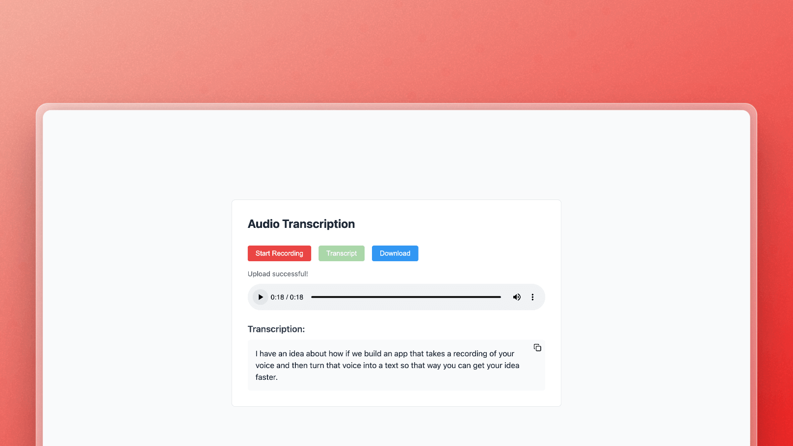

# VoixText

A web application that allows users to record audio and get a transcriptions using OpenAI's Whisper model locally. Built with FastAPI and Web Components.



See the demo on youtube: https://youtu.be/CT--fCB4K4g

## Features

- 🎤 Browser-based audio recording
- 📝 Real-time audio transcription using Whisper
- 📋 Copy transcription to clipboard
- 🎨 Clean, responsive UI with Tailwind CSS
- 🧩 Modular design using Web Components

## Tech Stack

- Backend: FastAPI, OpenAI Whisper
- Frontend: Vanilla JavaScript (Web Components), Tailwind CSS
- Audio: Web Audio API

## Installation

1. Clone the repository
```bash
git clone https://github.com/ahmadrosid/VoixText.git
cd VoixText
```

2. Install dependencies
```bash
pip install fastapi uvicorn python-multipart jinja2 openai-whisper
```

3. Run the application
```bash
uvicorn app.main:app --reload
```

The application will be available at `http://localhost:8000`

## Project Structure
```
.
├── app
│   ├── main.py
│   ├── static
│   │   └── audio-recorder.js
│   └── templates
│       └── index.html
```

## Contributing

Contributions are welcome! Please feel free to submit a Pull Request.

## License

This project is licensed under the MIT License - see the [LICENSE](LICENSE) file for details.

## Acknowledgments

- [OpenAI Whisper](https://github.com/openai/whisper) for the speech recognition model
- [Copy Icon Component](https://github.com/ahmadrosid/copy-icon) for the clipboard functionality

